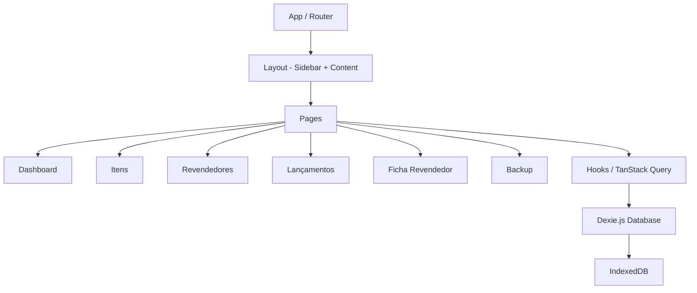

# Especificação Técnica — Sistema de Gestão de Revendedores

## Resumo Executivo

Aplicação SPA construída com React + Vite + TypeScript, usando Tailwind CSS e Shadcn UI para a interface, Dexie.js para persistência local via IndexedDB, e TanStack Query para gerenciamento de estado assíncrono. A arquitetura é baseada em componentes React com camada de dados desacoplada via hooks customizados.

## Arquitetura do Sistema

### Visão Geral dos Componentes



**Componentes principais:**

- **App/Router:** React Router DOM para navegação SPA
- **Layout:** Sidebar fixa com navegação + área de conteúdo
- **Pages:** Dashboard, Itens, Revendedores, Lançamentos, Ficha Revendedor, Backup
- **Hooks (TanStack Query):** `useItems`, `useResellers`, `useTransactions`, `useDashboard`
- **Database (Dexie.js):** Classe `AppDatabase` estendendo `Dexie` com tabelas definidas
- **Services:** `pdfService` (geração de PDF), `backupService` (import/export JSON)

## Design de Implementação

### Interfaces Principais

```typescript
// database.ts
interface Item {
  id?: number;
  name: string;
  basePrice: number;
  createdAt: Date;
  updatedAt: Date;
}

interface Reseller {
  id?: number;
  name: string;
  phone?: string;
  email?: string;
  notes?: string;
  createdAt: Date;
  updatedAt: Date;
}

type TransactionType = 'order' | 'payment' | 'signal';

interface Transaction {
  id?: number;
  resellerId: number;
  type: TransactionType;
  // Campos para pedido
  itemId?: number;
  itemName?: string;
  quantity?: number;
  unitPrice?: number;
  totalPrice: number;
  observation?: string;
  // Comum
  createdAt: Date;
}
```

### Modelos de Dados

**Banco Dexie.js — `AppDatabase`:**

| Tabela         | Índices                          |
|----------------|----------------------------------|
| `items`        | `++id, name`                     |
| `resellers`    | `++id, name`                     |
| `transactions` | `++id, resellerId, type, createdAt` |

### Estrutura de Diretórios

```
src/
├── components/
│   ├── layout/          # Sidebar, MainLayout
│   ├── ui/              # Componentes Shadcn UI
│   ├── items/           # ItemForm, ItemTable
│   ├── resellers/       # ResellerForm, ResellerTable
│   ├── transactions/    # TransactionForm
│   ├── dashboard/       # DashboardCards
│   └── backup/          # ImportExport
├── db/
│   └── database.ts      # Classe Dexie + tipos
├── hooks/
│   ├── useItems.ts
│   ├── useResellers.ts
│   ├── useTransactions.ts
│   └── useDashboard.ts
├── services/
│   ├── pdfService.ts
│   └── backupService.ts
├── pages/
│   ├── DashboardPage.tsx
│   ├── ItemsPage.tsx
│   ├── ResellersPage.tsx
│   ├── ResellerDetailPage.tsx
│   ├── TransactionsPage.tsx
│   └── BackupPage.tsx
├── lib/
│   └── utils.ts         # Formatadores, helpers
├── App.tsx
└── main.tsx
```

## Pontos de Integração

Não aplicável — aplicação puramente client-side sem integrações externas.

## Abordagem de Testes

### Testes de Unidade

- **Componentes:** Testes de renderização e interação com React Testing Library + Vitest
- **Hooks:** Testes dos hooks customizados com `renderHook`
- **Services:** Testes do `pdfService` e `backupService` isolados
- **Database:** Testes CRUD com `fake-indexeddb` para simular IndexedDB

### Testes de Integração

- **Fluxos completos:** lançar pedido → verificar saldo, exportar → importar → verificar dados
- **Componentes + Hooks:** renderizar pages com dados mock e verificar comportamento

### Testes E2E

- Testes com **Playwright** cobrindo fluxos críticos:
  - Criar item → Cadastrar revendedor → Lançar pedido → Verificar ficha
  - Exportar dados → Limpar → Importar → Verificar restauração

## Sequenciamento de Desenvolvimento

### Ordem de Construção

1. **Setup do projeto** — Base para tudo
2. **Camada de dados (Dexie.js + hooks)** — Dependência de todas as features
3. **Cadastro de Itens** — Simples, necessário para Pedidos
4. **Gestão de Revendedores** — Necessário para Lançamentos e Ficha
5. **Lançamento de Demanda** — Depende de Itens e Revendedores
6. **Ficha do Revendedor** — Depende de Lançamentos
7. **Dashboard** — Depende de dados existentes
8. **Import/Export** — Independente, mas testável somente com dados

### Dependências Técnicas

- Node.js ≥ 18
- npm como gerenciador de pacotes
- Dependências: `react`, `react-router-dom`, `@tanstack/react-query`, `dexie`, `dexie-react-hooks`, `tailwindcss`, `shadcn/ui`, `lucide-react`, `jspdf`, `jspdf-autotable`
- Dev: `vitest`, `@testing-library/react`, `fake-indexeddb`, `playwright`

## Monitoramento e Observabilidade

Não aplicável — aplicação local sem servidor.

## Considerações Técnicas

### Decisões Principais

| Decisão | Justificativa |
|---------|---------------|
| Dexie.js sobre localStorage | Suporta dados estruturados, índices e queries complexas |
| TanStack Query sobre Context API | Cache automático, invalidação, estados de loading/error |
| jsPDF sobre html2canvas | Gera PDFs nativos, mais leve e controlável |
| Tailwind + Shadcn | Componentes prontos e consistentes, produtividade alta |

### Riscos Conhecidos

- **Limite de armazenamento IndexedDB:** Navegadores podem limitar (~50MB–unlimited com permissão). Mitigação: alertar usuário quando próximo do limite
- **Perda de dados:** Limpar dados do navegador apaga tudo. Mitigação: funcionalidade de export/import como backup
- **Compatibilidade de navegador:** IndexedDB tem suporte amplo, mas Safari pode ter limitações em modo privado

### Conformidade com Padrões

Não foram encontradas rules na pasta `.claude/rules`.

### Arquivos relevantes e dependentes

- [prompt1.md](file:///home/vinicius-casarin/repos/study/easy/prompts/prompt1.md) — Requisitos originais
- [prd.md](file:///home/vinicius-casarin/repos/study/easy/tasks/prd-gestao-revendedores/prd.md) — PRD desta funcionalidade
